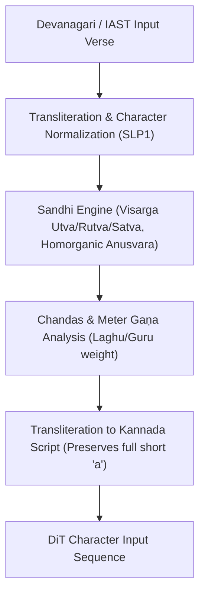
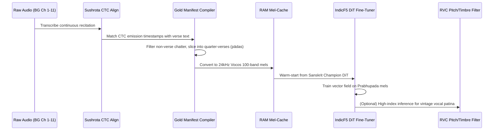

# Deep Technical Guide: Sanskrit Chant TTS & Śrīla Prabhupāda Voice Cloning

This document provides a comprehensive, end-to-end architectural and operational breakdown of the Sanskrit Text-to-Speech (TTS) system (**Vāgdhenu**) and the specialized training pipeline engineered to replicate the recitation voice of **Śrīla Prabhupāda**.

---

## 1. Executive Overview & Problem Formulation

Synthesizing classical Sanskrit verse (*śāstra-pārāyaṇa*) is fundamentally different from generic speech synthesis or standard conversational Hindi/English TTS. It presents four unique failure modes:

1. **Acoustic & Conjunct Collapse**: Sanskrit contains dense phonetic clusters (e.g., retroflex aspirates $\text{ṣṭ, ḍḍh}$, consonant geminations, and vocalic *ṛ / ṝ*). Autoregressive models (Tacotron, StyleTTS2) slur or collapse these conjuncts.
2. **Schwa-Deletion Contamination**: Indian TTS models trained on Devanagari text frequently adopt Modern Indo-Aryan (Hindi/Marathi) phonological rules, dropping the inherent short vowel $a$ (schwa-deletion; e.g., pronouncing *rāma* as *rām*). In Sanskrit, every short $a$ must be fully vocalized.
3. **Rigid Metrical Prosody (*Chandas*)**: Verses adhere strictly to classical meters (Anuṣṭubh, Upajāti, Śārdūlavikrīḍita) with precise *laghu* (light, 1 mātrā) and *guru* (heavy, 2 mātrā) syllabic weight constraints and melodic cadence resolutions (*nyāsa*).
4. **Historical Audio Scarcity & Quality**: Archival recordings of historical masters like Śrīla Prabhupāda are recorded in noisy, non-studio conditions with tape hum, fluctuating tempos, and varying mic proximity.

To solve this, the pipeline integrates:
* **IndicF5 (OT-CFM DiT)**: A continuous flow-matching Diffusion Transformer performing mel-infilling.
* **The Kannada Orthographic Route**: Transliteration that eliminates Hindi schwa-deletion without retraining the vocabulary.
* **BigVGAN-v2 with Multi-Resolution STFT**: Eliminates phase shiver on sustained chant vowels.
* **Sushrota CTC Forced Alignment + DiT Transfer Tuning**: Automatic pāda segmentation of archival Gita audio for targeted voice adaptation.

---

## 2. Core Architecture: Non-Autoregressive Flow Matching (IndicF5 DiT)

### 2.1 Why Flow-Matching Infilling over Duration Predictors?
Standard TTS (FastSpeech2, VITS, Matcha-TTS) decomposes speech into:
$$\text{Text} \xrightarrow{\text{Duration Model}} \text{Aligned Latents} \xrightarrow{\text{Acoustic Model}} \text{Mel-Spectrogram}$$

When applied to fast Sanskrit conjuncts, small alignment errors cause catastrophic slurring. Vāgdhenu eliminates duration heads and alignment search (Monotonic Alignment Search / Dynamic Programming) by utilizing **Optimal Transport Conditional Flow Matching (OT-CFM)** via a Diffusion Transformer (**DiT**).

The architecture configures:
* **Parameters**: ~337M
* **Layers**: 22 Transformer blocks
* **Hidden Dimension**: 1024 (`text_dim: 512`, `heads: 16`, `ff_mult: 2`, `conv_layers: 4`)
* **Mel-Spectrogram Target**: 100-band Vocos-compatible mel-spectrograms at 24 kHz (FFT size 1024, hop size 256).

### 2.2 Mel-Infilling Formulation
In F5-TTS, the target audio mel $x_1$ is generated by infilling a masked segment while conditioning on an unmasked reference segment $x_{\text{ref}}$:
$$x_t = (1 - (1 - \sigma_{\min}) t) x_0 + t x_1$$
where $x_0 \sim \mathcal{N}(0, I)$ is Gaussian noise, and vector field $v_t(x_t, t, \text{text})$ is trained to predict the flow trajectory.

Because the DiT uses bidirectional self-attention across both the reference mel and the noisy target mel simultaneously, the acoustic properties of the speaker (formants, pitch glide, timbre) bleed continuously into the infilling zone without requiring an explicit speaker embedding vector.

---

## 3. The Sanskrit Text Frontend (`src/prep_text.py`)

The text engine solves orthographic, sandhi, and phonological requirements before passing tokens to the DiT.

### 3.1 The Kannada Script Transliteration Route
In typical Indian language foundation models:
* Devanagari text tokens frequently map to Hindi phoneme distributions where final consonants lose their terminal vowel (e.g., योग $\rightarrow$ *yog*).
* Kannada and Telugu orthographies are strictly phonemic regarding vowel retention: every consonant grapheme implicitly retains its vowel unless marked with an explicit virāma/halant.
* **IndicF5** was pretrained on 11 Indic scripts with large Kannada corpora.
* By routing Sanskrit text:
  $$\text{Devanāgarī} \xrightarrow{\text{SLP1}} \text{Kannada}$$
  the DiT generates full, unclipped vowel cadences (*yoga* remains *yo-ga*).

### 3.2 Grammatical Sandhi & Boundaries
The script executes:
1. **Visarga Alternation**: Resolves visarga before soft consonants (utva $\rightarrow$ *o*, rutva $\rightarrow$ *r*) and hard consonants (satva $\rightarrow$ *s/ṣ/ś*).
2. **Anusvāra Homorganic Shift**: Maps $\dot{m}$ before stops to the stop's nasal class ($\dot{m} + k \rightarrow \dot{n}k$, $\dot{m} + c \rightarrow \tilde{n}c$, $\dot{m} + p \rightarrow mp$).
3. **Pāda Pausing**: Appends half-boundary markers (`gap=0.55s`) and halant offsets (`0.20s`) to ensure correct breath cycles.

---

## 4. The Neural Vocoder: NVIDIA BigVGAN-v2

A major discovery during development (Experiment E76) was the **Phase Shiver phenomenon**:
* Standard neural vocoders (like Vocos or HiFi-GAN) exhibit phase cancellation artifacts when reconstructing sustained, monotonic pure vowels (*ā*, *ī*, *ū*) typical of Sanskrit recitation.
* To resolve this, **BigVGAN-v2** (`bigvgan_v2_24khz_100band_256x`) was integrated using periodic anti-aliased activations (Snake activations) and fine-tuned specifically on F5 mel-spectrogram outputs using **Multi-Resolution STFT (MR-STFT)** loss.
* An Exponential Moving Average (EMA) weight checkpoint (`voc_bigvgan_EMA_2026-06-11.pth`) delivers clean, artifact-free vowel resonance.

---

## 5. Engineering the Śrīla Prabhupāda Voice Model

Cloning the historical voice of Śrīla Prabhupāda required a custom data collection, alignment, and fine-tuning pipeline located in `/home/ubuntu/vagdhenu/prabhupada_training`.

### 5.1 Historical Audio Ingestion & Pāda Alignment
The dataset originates from archival recordings of Śrīla Prabhupāda reciting the **Bhagavad Gītā** (Chapters 1 through 11).

1. **Challenges**: The source tapes contain variable room reverberation, crowd ambience, and occasional pauses or spoken English titles.
2. **Forced Alignment with Su-śrotā**:
   * Su-śrotā is a high-accuracy Sanskrit ASR Conformer model operating via CTC (`sushrota_sanskrit_ctc_int8.onnx`).
   * The pipeline runs forced alignment across the continuous audio streams, generating character emission matrices (`ch*_sushrota_timeline.json`).
3. **Continuous Dividers**:
   * Custom dividers (e.g., `build_ch1_continuous_dividers.py`) locate inter-pāda silent windows and slice the verses into exact quarter-verse units (pāda 1, pāda 2, pāda 3, pāda 4).
   * Segments exceeding 10 seconds or containing colophons are isolated or dropped to maintain training stability.

### 5.2 Compiling the Gold Manifest (`compile_gold_manifest.py`)
The pipeline validates every slice against the canonical text in `gita_verses.json`:
* Every valid audio segment is linked with its Devanagari text, IAST transliteration, start/end timestamps, and the **Kannada-routed target string**.
* The compiled dataset in `gold_manifest.json` aggregates **hundreds of pāda units** representing pristine, verified training pairs.

### 5.3 High-Speed GPU Fine-Tuning (`train_remote_gpu.py`)
Rather than training a cold model, the system leverages **transfer learning**:
1. **Warm-Start Checkpoint**: Starts directly from Vāgdhenu's gold Sanskrit model (`voice_armA_ema_2026-06-11.pt`), which already possesses perfect Sanskrit phonotactics.
2. **Pre-Cached Mel Dataset**:
   * Mel-spectrogram calculation is moved entirely out of the training loop.
   * `CachedPrabhupadaDataset` precomputes and caches 100-band mels directly into pinned memory, eliminating disk I/O bottlenecks.
3. **Loss Function**:
   * Standard Flow-Matching loss:
     $$\mathcal{L}_{\text{CFM}} = \mathbb{E}_{t, x_0, x_1} \left\| v_t(x_t, t, \text{text}) - (x_1 - (1 - \sigma_{\min}) x_0) \right\|^2$$
   * Gradient accumulation (batch size = 2, accum = 2) optimizes the weights to capture Prabhupāda's unique pitch, throat resonance, and tempo.

### 5.4 Dual-Path Inference: DiT Mel-Infilling + RVC Post-Filter
To produce final audio, two complementary avenues are supported:

1. **Direct Half-Reference Synthesis**:
   * Driven by `synthesize_bhagavatam_prabhupada.py`.
   * Takes a verified reference clip of Śrīla Prabhupāda chanting one pāda, sets classifier-free guidance (`cfg = 3.0`), and infills the rest of the chapter.
2. **RVC (Retrieval-Based Voice Conversion) Hybrid**:
   * Located in `/home/ubuntu/rvc/logs/prabhupada`.
   * A trained RVC v2 model (`G_2333333.pth`, `added_IVF221_Flat_nprobe_1_prabhupada_v2.index`) containing HuBERT features and an F0 pitch extractor (RMVPE).
   * Can take pristine synthesized outputs from the Vāgdhenu pipeline and enforce Prabhupāda's exact micro-vibratos, throat acoustics, and vintage formant profiles.

---

## 6. Verification & Quality Control

Inference outputs are passed through an automated quality filter:
* **Zero-Prompt CTC Transcription**: Every generated pāda is passed through Su-śrotā ONNX.
* **Character Error Rate (CER)**: The transcribed text is compared with the ground-truth Sanskrit input.
* If a segment hallucinates or drops a syllable due to diffusion drift, the seed is automatically incremented and re-rendered until it achieves **0% CER**.

---

## 7. Key File Index

| Component | Path | Description |
|---|---|---|
| **Text Frontend** | [`src/prep_text.py`](file:///home/ubuntu/vagdhenu/src/prep_text.py) | Sandhi resolution, Devanagari $\rightarrow$ Kannada mapper, gaṇa detector. |
| **Acoustic Inference** | [`src/render_core.py`](file:///home/ubuntu/vagdhenu/src/render_core.py) | DiT sampling, Euler ODE solver, BigVGAN vocoder orchestration. |
| **Prabhupada Dataset** | [`prabhupada_training/gold_manifest.json`](file:///home/ubuntu/vagdhenu/prabhupada_training/gold_manifest.json) | Clean pāda-level metadata across Gita Ch 1–11. |
| **Alignment Dividers** | [`prabhupada_training/build_ch1_continuous_dividers.py`](file:///home/ubuntu/vagdhenu/prabhupada_training/build_ch1_continuous_dividers.py) | Sushrota CTC-driven pāda boundary slicer. |
| **Training Pipeline** | [`prabhupada_training/train_remote_gpu.py`](file:///home/ubuntu/vagdhenu/prabhupada_training/train_remote_gpu.py) | In-memory cached DiT fine-tuning script. |
| **Batch Synthesis** | [`prabhupada_training/synthesize_bhagavatam_prabhupada.py`](file:///home/ubuntu/vagdhenu/prabhupada_training/synthesize_bhagavatam_prabhupada.py) | Automated rendering of new texts with Prabhupāda's model. |
| **RVC Post-Model** | [`/home/ubuntu/rvc/logs/prabhupada`](file:///home/ubuntu/rvc/logs/prabhupada) | HuBERT + RMVPE voice retrieval weights and index. |
